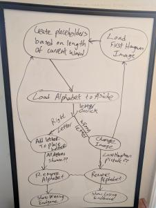
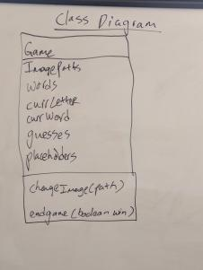
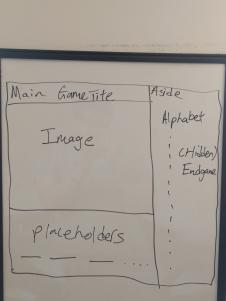

# Hangman
Hangman web game application based on one word movies.

## Technologies and Frameworks Used
### Ubuntu 18.04.2 LTS Web Server
### JQuery
### Javascript, HTML, CSS

## Tools Used
### Trello
<https://trello.com/>
### ReText
<https://github.com/retext-project/retext>

## Prerequisites
- Most recent versions of Firefox or Google Chrome
- Some features might not work on Internet Explorer

## Whitebording

## Wireframe

## Project Board
### Trello Board
<https://trello.com/b/hwp0kWsF/hangman-project>

## Image References
### Game Loss .gif
<https://giphy.com/gifs/lol-special-ur-QJKu9V1DTvGI0TWdEa>
### Game Win .gif
<https://giphy.com/gifs/party-birthday-dancing-5tlq0pRndGu8U>
